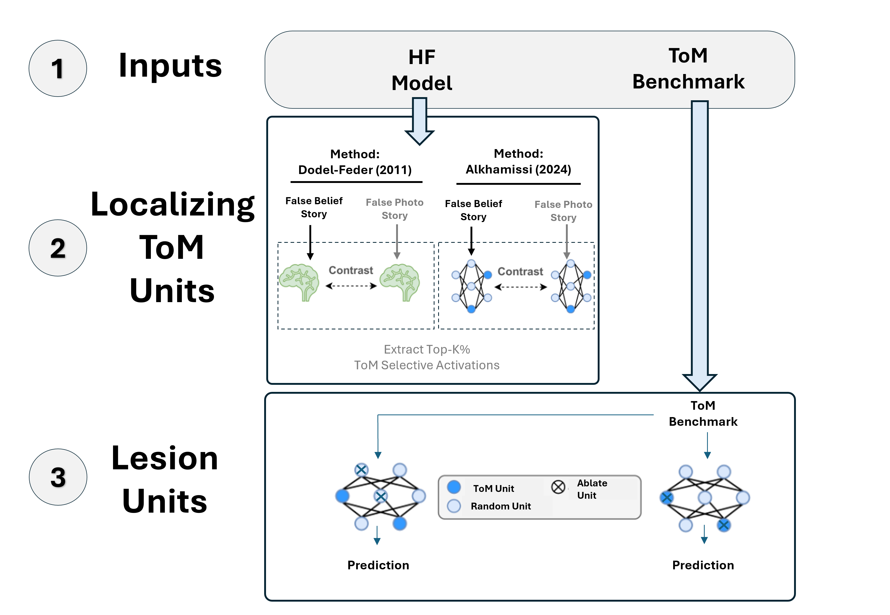

# The ```ToMechanisms``` repo

[](https://YOUR_GITHUB_NICKNAME.github.io/YOUR_PACKAGE_NAME)

```ToMechanisms``` is an open-source repo that explore mechanistic interpretability of Language and Vision-Language Models to identify networks associated with Theory of Mind and Multiple Demand task. Inspired by a contrast-based localizer method used in fMRI to identify causal brain region for a specific task, this project builds upon the neuroscientific approach introduced in *`AlKhamissi et al., 2024`*. Their results demonstrate that this method for identifying the brain’s language network can also be effectively applied to LLMs. The purpose of this project is to extend the analysis to Theory of Mind.

In ```ToMechanims```, we propose a framework that enables anyone to apply the functional localizer approach to any LLM or VLM model available on Hugging Face, regardless of model size or the computational resources available, whether using a single GPU, multiple GPUs, or no GPU at all.


<p align="center">
  
  
</p>

# Abstract

We investigate the use of contrast-based functional localizers–a paradigm inspired by cognitive neuroscience–to identify key neural units that underpin social and mathematical reasoning in large foundation models. Motivated by recent breakthroughs in large language models and advances in mechanistic interpretability, our study adopts the traditional approaches to capture model correlates of Theory-of-Mind (ToM) and Multiple-Demand (MD) processes. Using curated task contrasts, we localized candidate units across a range of transformer-based language models and vision-language models, and then applied targeted lesioning to assess their causal role in task performance on false-belief tasks and math reasoning. Two contrast localizer methods were evaluated: one in which the t-distribution was computed after converting the activation units into their absolute values, and an alternate method that computed the t-distribution directly on the raw, signed activations. For both approaches, while lesioning the most activated units does not induce a significant degradation in accuracy beyond that observed with random unit ablations, unexpected behaviors were observed: lesioning the least activated units sometimes led to either performance degradation or improvement, and the MD localizer impaired performance on both math and ToM tasks. These findings raise concerns about the specificity of the current localizer design for isolating MD and ToM reasoning, highlighting the need for further investigation to refine the method and more accurately capture task-specific activation dynamics.

## Table of Contents

1. [Setup](#setup)   
   - [Dependencies](#dependencies)  

2. [Usage](#usage)  
 


## Setup

### Dependencies

Firstly, create an enviornment to install the packages
```
conda create -n llm-loc # Create conda environment
conda activate llm-loc # Activate environment
pip install -r requirements.txt # Install packages
```
then, create `.env` file  to store your token from huggingface and the cache directory where Foundation Models will be saved.   
```
# .env file
CACHE_DIR=to/your/directory/cache
HF_ACCESS_TOKEN=<Huggingface token>
 ```

## Usage
This script runs experiments with language models using different benchmarks and localization methods.

### Command-Line Arguments
```
python experiment/EXTRA_ANALYSIS/run.py [--model_func MODEL_FUNC]
                 [--model_name MODEL_NAME]
                 [--cache CACHE_DIR]
                 [--localizer LOCALIZER]
                 [--method METHOD]
                 [--benchmark_names BENCHMARK_NAMES [BENCHMARK_NAMES ...]]
```

### Example
```
python script.py --model_func AutoModelForCausalLM \
                 --model_name meta-llama/Llama-3.2-1B-Instruct \
                 --cache ./cache \
                 --localizer ToM \
                 --method revised \
                 --benchmark_names ToMi FanToM
```

| Argument            | Default                            | Description                                                                |
| ------------------- | ---------------------------------- | -------------------------------------------------------------------------- |
| `--model_func`      | `AutoModelForCausalLM`             | Model loading function (e.g., for VLMs or LLMs).                           |
| `--model_name`      | `meta-llama/Llama-3.1-8B-Instruct` | Model checkpoint path from HuggingFace or local.                           |
| `--cache`           | `CACHE_DIR`                        | Path to cache directory (used for temporary storage).                      |
| `--localizer`       | `ToM`                              | Type of functional localizer (`ToM`, `MD`, or `language`).                 |
| `--method`          | `revised`                          | Lesioning method (`revised` or `initial`).                                 |
| `--benchmark_names` | `ToMi`                             | List of benchmarks to evaluate (`ToMi`, `FanToM`, `MATH`, `OpenToM`, `MMStar`, `MathVista`) |


